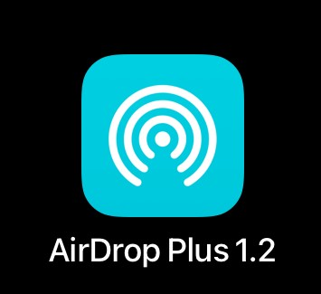
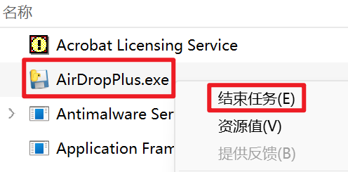

# AirDrop Plus

用于 iOS 设备和 Windows 电脑之间进行文件传输，基于 HTTP，需要配合快捷指令使用

# 依赖

```
python==3.10.6
flask==3.0.0
win10toast==0.9
psutil==5.9.6
pyinstaller==6.2.0
windows_toasts==1.0.1
pillow==10.1.0
pyperclip~=1.8.2
pystray==0.19.5
```

# 打包

```bash
pyinstaller --add-data 'config;config' --add-data 'static;static' -w AirDropPlus.py
```

# 使用
1. Windows安装bonjour，这样就可以通过 '设备名.local' 访问到Windows，而不需要通过IP地址。
    <div style="text-align:center;">
        
    </div>
2. 修改配置文件 'config.ini'，设置文件保存路径和密钥（打包后的配置文件在'_internal/config.ini'）
3. 手机端下载快捷指令：https://www.icloud.com/shortcuts/a10fa721e97b4f67b1703c0730b12c06
4. 设置快捷指令：
   - 主机：Windows设备名.local
   - 密钥：'config.ini' 中设置的密钥相同
   - 简化：启用时会关闭发送iOS剪贴板的功能
   <div style="text-align:center;">
       
   </div>
5. 使用条件：iOS设备和Windows设备在同一个局域网下，也可以是Windows连接iOS的热点，或者iOS连接Windows的热点，使用热点发送文件不消耗流量
6. 功能测试
  - 发送文件：在文件分享菜单执行'AirDrop Plus'快捷指令
  - 接收文件：直接执行'AirDrop Plus'快捷指令，也可以在辅助功能中设置成双击手机背面触发，15 Pro系列可以设置成侧边按钮触发。
    - 当'简化'被开启时，运行后iOS接收Windows上复制的内容(文件、图像、文本)。
    - 当'简化'被关闭时，运行后会弹出一个菜单，选择发送iOS剪贴板，还是接收Windows剪贴板
    <div style="text-align:center;">
      
      
    </div>
7. 退出程序：在Windows任务管理器中右键'AirDropPlus.exe'，点击结束任务
    <div style="text-align:center;">
        
    </div>

# 问题
1. 快捷指令运行超时：可能的原因

# API
## 请求头参数
| 参数名             | 类型     | 描述                                                            |
|-----------------|--------|---------------------------------------------------------------|
| ShortcutVersion | String | 快捷指令的版本，需要和 config.ini 中的 version 一致                          |
| Authorization   | String | 密钥，需要和 config.ini 中的 key 前两位一致，例如 config.ini 为 1.5.1，此处需要是1.5 |

## 文件发送
> 移动端发送一个文件到PC
### 请求
#### 请求方式
- HTTP 方法: POST
- URL: /file/send
#### 请求参数
- 发送格式: 表单

| 参数名            | 类型     | 描述                                                                                                                                |
|----------------|--------|-----------------------------------------------------------------------------------------------------------------------------------|
| file           | File   | 要发送的文件                                                                                                                            |
| filename       | String | 发送的文件名                                                                                                                            |
| notify_content | String | 让PC端通知显示的内容<br/>如果是发送单个文件：这里填写的就是 filename 的内容<br/>如果是发送n个文件：前n-1个的 notify_content 为空，第n个的 notify_content 包含n个文件的 filename，使用\n分隔 |

### 返回
- 返回类型: JSON
- 返回内容:
    ```json
    {
        "success": true,
        "msg": "发送成功",
        "data": null
    }
    ```
  
## 文件发送列表
> 移动端发送文件列表到PC（通知PC接下来要发送哪些文件）
### 请求
#### 请求方式
- HTTP 方法: POST
- URL: /file/send/list
#### 请求参数
- 发送格式: 表单

| 参数名       | 类型     | 描述                                    |
|-----------|--------|---------------------------------------|
| file_list | String | 要发送的文件列表，文件之间用\n分隔，如：aaa.jpg\nbbb.png |

### 返回
- 返回类型: JSON
- 返回内容:
    ```json
    {
        "success": true,
        "msg": "发送成功",
        "data": null
    }
    ```

## 文件接收
> 移动端接收PC上的文件
### 请求
#### 请求方式
- HTTP 方法: POST
- URL: /file/receive
#### 请求参数
- 发送格式: 表单

| 参数名      | 类型     | 描述        |
|----------|--------|-----------|
| path     | String | 要接收的文件的路径 |
### 返回
- 返回类型: 文件
- 返回内容: 文件

## 剪贴板发送
> 把移动端的剪贴板发送到PC的剪贴板
### 请求
#### 请求方式
- HTTP 方法: POST
- URL: /clipboard/send
#### 请求参数
- 发送格式: 表单

| 参数名       | 类型     | 描述       |
|-----------|--------|----------|
| clipboard | String | 移动端剪贴板内容 |

### 返回
- 返回类型: JSON
- 返回内容:
    ```json
    {
        "success": true,
        "msg": "发送成功",
        "data": null
    }
    ```
## 剪贴板接收
> 发送PC的剪贴板内容
### 请求
#### 请求方式
- HTTP 方法: GET
- URL: /clipboard/receive
#### 请求参数
- 无
### 返回
- 返回类型: JSON
- 返回内容: 
  - 剪贴板内容为文本时:
    ```json
    {
        "success": true,
        "msg": "",
        "data": {
          "type": "text",
          "data": "clipboard_text"
        } 
    }
    ```
  - 剪贴板为文件时:
      ```json
      {
          "success": true,
          "msg": "",
          "data": {
            "type": "file",
            "data": ["c:/xx/xx/aa.png", "c:/xx/xx/bb.pdf"]
          }
      }
      ```
  - 剪贴板为图像时:
      ```json
      {
          "success": true,
          "msg": "",
          "data": {
            "type": "img",
            "data": "img_base64_code"
          }
      }
      ```
