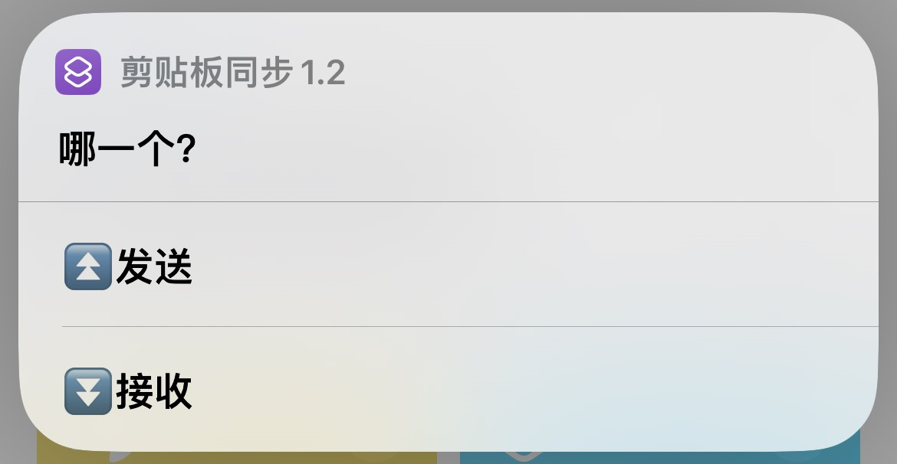

# AirDrop Plus

用于 iOS 设备和 Windows 电脑之间进行文件传输，基于 HTTP，需要配合快捷指令使用

# 依赖

```
python==3.12.1
flask==3.0.0
win10toast==0.9
psutil==5.9.7
pyinstaller==6.3.0
windows_toasts==1.0.2
```

# 打包

```bash
pyinstaller --add-data 'config;config' -w AirDropPlus.py
```

# 使用

## 直接下载Releases!!!
## 直接下载Releases!!!
## 直接下载Releases!!!
1. Windows 端安装 bonjour，这样可以通过 “设备名.local” 访问到 Windows，而不需要通过 IP 地址。
    <div style="text-align:center;">
        
    </div>
2. 修改配置文件 config.ini，设置文件保存路径和密钥(在Releases!!!里)
3. 手机端下载快捷指令
   - 文件：https://www.icloud.com/shortcuts/dbbc2d75a611471babbe69e128db6702
   - 剪贴板：https://www.icloud.com/shortcuts/8b0a81ddf004422fbbb8fc8099546811
4. 设置快捷指令的主机为 `Windows 的设备名`.local，设置快捷指令的密钥和 config.ini 中的密钥相同
    <div style="text-align:center;">
        
    </div>
5. 发送文件时在文件分享菜单执行 AirDrop Plus 快捷指令。接收文件时，直接执行 AirDrop Plus 快捷指令
    <div style="text-align:center;">
        
        
    </div>
6. 同步剪贴板直接执行快捷指令，点击发送或者接收!
    <div style="text-align:center;">
        
    </div>
7. Windows 端退出在任务管理器中退出
    <div style="text-align:center;">
        
    </div>

> 这里直接 Shift+Ctrl+Esc


# API
## 请求头参数
| 参数名             | 类型     | 描述                                   |
|-----------------|--------|--------------------------------------|
| ShortcutVersion | String | 快捷指令的版本，需要和 config.ini 中的 version 一致 |
| Authorization   | String | 密钥，需要和 config.ini 中的 key 一致          |

## 文件发送
> 移动端发送一个文件到PC
### 请求
#### 请求方式
- HTTP 方法: POST
- URL: /file/send
#### 请求参数
- 发送格式: 表单

| 参数名            | 类型     | 描述                                                                                                                                |
|----------------|--------|-----------------------------------------------------------------------------------------------------------------------------------|
| file           | File   | 要发送的文件                                                                                                                            |
| filename       | String | 发送的文件名                                                                                                                            |
| notify_content | String | 让PC端通知显示的内容<br/>如果是发送单个文件：这里填写的就是 filename 的内容<br/>如果是发送n个文件：前n-1个的 notify_content 为空，第n个的 notify_content 包含n个文件的 filename，使用\n分隔 |

### 返回
- 返回类型: JSON
- 返回内容:
    ```json
    {
        "success": true,
        "msg": "发送成功",
        "data": null
    }
    ```
  
## 文件发送列表
> 移动端发送文件列表到PC（通知PC接下来要发送哪些文件）
### 请求
#### 请求方式
- HTTP 方法: POST
- URL: /file/send/list
#### 请求参数
- 发送格式: 表单

| 参数名       | 类型     | 描述                                    |
|-----------|--------|---------------------------------------|
| file_list | String | 要发送的文件列表，文件之间用\n分隔，如：aaa.jpg\nbbb.png |

### 返回
- 返回类型: JSON
- 返回内容:
    ```json
    {
        "success": true,
        "msg": "发送成功",
        "data": null
    }
    ```
## 文件接收列表
> 获取PC复制的文件的文件地址列表
### 请求
#### 请求方式
- HTTP 方法: GET
- URL: /file/receive/list
#### 请求参数
- 无
### 返回
- 返回类型: JSON
- 返回内容: 
    ```json
    {
        "success": true,
        "msg": "",
        "data": ["c:/xx/xx/aa.txt", "c:/xx/xx/bb.txt"]
    }
    ```

## 文件接收
> 移动端接收PC上的文件
### 请求
#### 请求方式
- HTTP 方法: POST
- URL: /file/receive
#### 请求参数
- 发送格式: 表单

| 参数名      | 类型     | 描述        |
|----------|--------|-----------|
| path     | String | 要接收的文件的路径 |
### 返回
- 返回类型: 文件
- 返回内容: 文件

## 剪贴板发送
> 把移动端的剪贴板发送到PC的剪贴板
### 请求
#### 请求方式
- HTTP 方法: POST
- URL: /clipboard/send
#### 请求参数
- 发送格式: 表单

| 参数名       | 类型     | 描述       |
|-----------|--------|----------|
| clipboard | String | 移动端剪贴板内容 |

### 返回
- 返回类型: JSON
- 返回内容:
    ```json
    {
        "success": true,
        "msg": "发送成功",
        "data": null
    }
    ```
## 剪贴板接收
> 把PC端的剪贴板发送到移动端的剪贴板
### 请求
#### 请求方式
- HTTP 方法: GET
- URL: /clipboard/receive
#### 请求参数
- 无
### 返回
- 返回类型: JSON
- 返回内容: 
    ```json
    {
        "success": true,
        "msg": "",
        "data": "PC端剪贴板的内容"
    }
    ```
