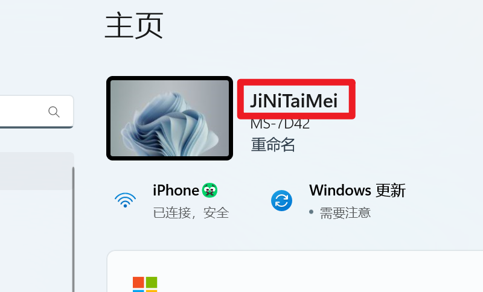
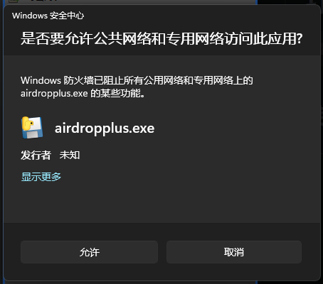
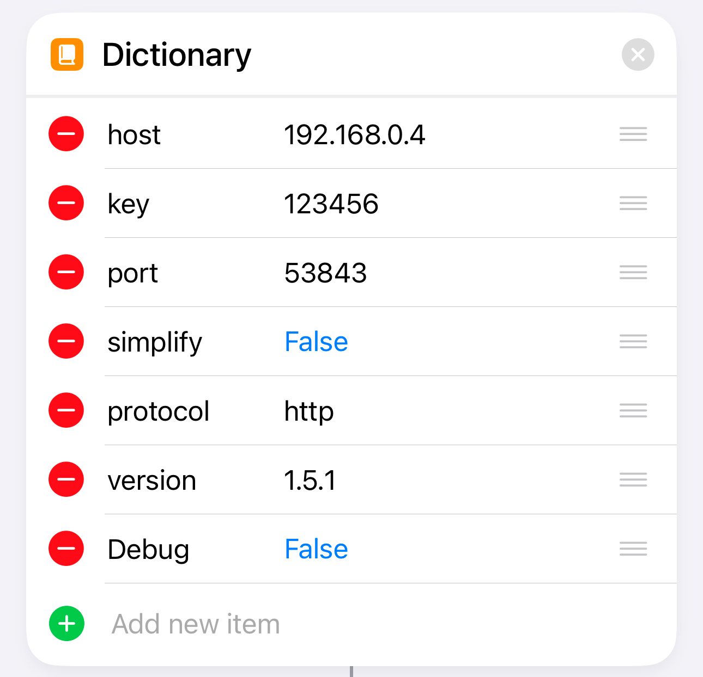
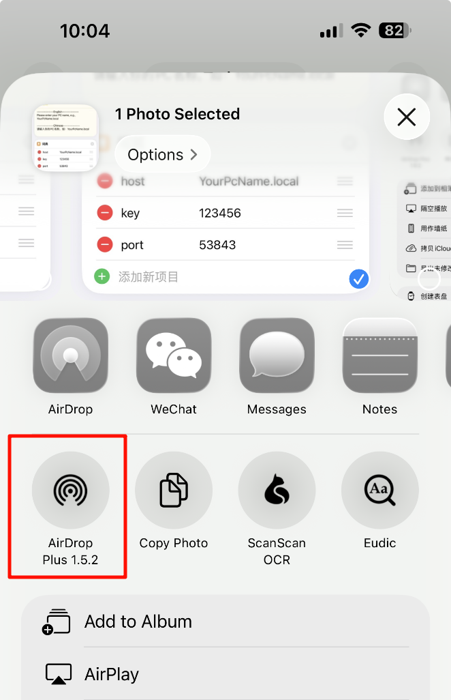
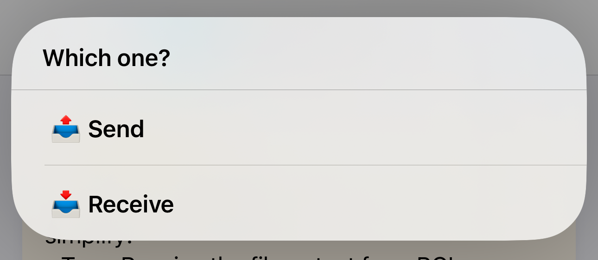
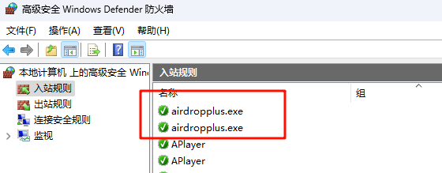
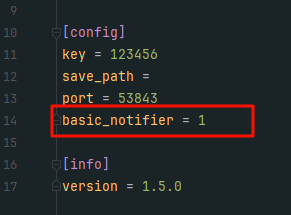
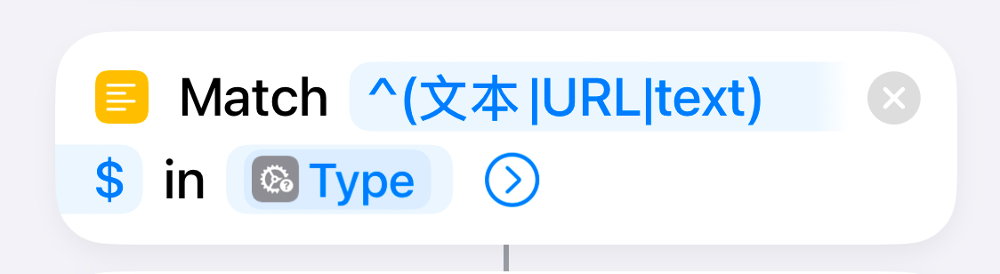

# AirDrop Plus

A file transfer and clipboard synchronization tool between Windows and iOS devices implemented using Python and Shortcuts.

[中文](readme_zh.md)

# Buy the author a coffee
<div style="text-align:center;">
    <p>Alipay</p>
    
    <p>WechatPay</p>
    
</div>

# Requirements

```
flask==3.0.0
flask-babel==4.0.0
pillow==10.1.0
pystray==0.19.5
pyinstaller==6.2.0
windows-toasts==1.3.1
pyperclip==1.8.2
```

# Packaging

```bash
python build.py
```

# Usage
0. Network
    
    - Your iPhone and PC must be on the same LAN, or the PC can connect to the iOS hotspot, or vice versa.
    - (It doesn't use data when transferring files via a hotspot.)
1. Install Bonjour on PC (optional)
    - Bonjour allows you to access Windows using the 'hostname.local' instead of an IP address.
    - The latest version of Bonjour may encounter issues accessing 'hostname.local'. Please use an older version instead.
    <div style="text-align:center;">
        
    </div>
2. Set up AirdropPlus
    - Right click on the tray icon and open the web menu with settings.
3. Start AirDropPlus.exe
   
    Start 'AirDropPlus.exe', and when prompted with the following pop-up, please click to allow.
    <div style="text-align:center;">
      
    </div>
4. Get the shortcut on your iPhone.

   https://www.icloud.com/shortcuts/d8ba54ce9e674becaf951a076ac1d967
      <div style="text-align:center;">
       
   </div>
5. Set up the shortcut:
   - host：'hostname.local' (or the host IP address instead)
   - port：The same port as that in the PC-side settings
   - key：The same key as that in the PC-side settings
   - simplify：Enabling this will disable the function to send the iOS clipboard
   <div style="text-align:center;">
       
   </div>
6. Set the trigger method of the shortcut:
   1. Set it up in 'Settings-Accessibility-Touch-BackTap' to trigger with a double-tap on the back of the iPhone.
   2. The iPhone 15 Pro series can set it to trigger with the side button.
7. Functionality Testing:
    - **Send files**:

      Tap the 'AirDrop Plus' shortcut from the file sharing menu.
      <div style="text-align:center;">
        
      </div>
   - **Send texts**:
     1. Copy the text which you want to send.
     2. Trigger the shortcut, then tap the 'Send' option.
     <div style="text-align:center;">
       
     </div>
   - **Receive files or texts**: 
     1. Trigger the shortcut
     2. Tap the 'Receive' option to receive file or text from PC's clipboard.
     <div style="text-align:center;">
       
     </div>

# Issues and solutions
### 1. Shortcut Timeout:
1. Check if the local area network (LAN) environment is unobstructed. In campus network environments, communication with LAN devices may be prohibited.
2. Check if the port in the PC-side settings is the same as that set in the shortcut commands.
3. Ensure that the hostname set in the shortcut is consistent with **the PC's hostname** (the hostname should not be in Chinese). You can also try changing **hostname.local** to **IP address**.
4. Check if the PC's firewall is blocking the port set in the **config.ini** file. Remove all entries related to AirDropPlus and restart AirDropPlus. After the restart, please allow the pop-up for network requests.
    <div style="text-align:center;">
      
      
    </div>

### 2. No notification after startup, but the process is running in the background:
1. It's possible that the PC's system version is too old to support interactive notifications. Try changing to basic notifications in the **config.ini** file.
    <div style="text-align:center;">
      
    </div>

### 3. The iPhone sent a Clipboard, but the PC received a file
1. Up to now, the input type obtained via the shortcut depends on the language of the iOS device. I have only considered input types in English, Simplified Chinese, and Traditional Chinese. If your iOS device is set to another language, errors may occur.
2. You can try adding the type name of 'Text' in your iOS device's language into the brackets, separated by '|'.
    <div style="text-align:center;">
      
    </div>

# API
## 0. Request Header Parameters
| Arg Name        | Type   | Description                                                                                                                                                     |
|-----------------|--------|-----------------------------------------------------------------------------------------------------------------------------------------------------------------|
| ShortcutVersion | String | The version of the shortcut. It must match the 'version' in the config.ini file.                                                                                |
| Authorization   | String | The key. It must match the first two segments of the 'key' in the config.ini file. For example, if the config.ini file has a version 1.5.1, this should be 1.5. |

## 1. Send File
> Send a file from the mobile device to the PC.
### URL
[POST] /file

Request Body: Form

| Arg Name | Type | Description      |
|----------|------|------------------|
| file     | File | The File to Send |

### Return
- Return Type: JSON
- Return Content:
    ```json
    {
        "success": true,
        "msg": "发送成功",
        "data": null
    }
    ```
## 2. Retrieve File
> Retrieve a file on the PC
### URL
[GET] /file/[path]

| Arg Name | Type   | Description                      |
|----------|--------|----------------------------------|
| path     | String | Base64 encoding of the file path |
### Return
- Return Type: File

## 3. Send Clipboard
> Send the clipboard to PC
### URL
[POST] /clipboard
### Request Parameters
- Request Body: Form

| Arg Name  | Type   | Description              |
|-----------|--------|--------------------------|
| clipboard | String | Mobile Clipboard Content |

### Return
- Return Type: JSON
- Return Content:
    ```json
    {
        "success": true,
        "msg": "发送成功",
        "data": null
    }
    ```
## 4. Retrieve Clipboard Content
> Retrieve the Clipboard Content on PC
### URL
[GET] /clipboard
### Return
- Return Type: JSON
- Return Content: 
  - When the Clipboard Contains Text:
    ```json
    {
        "success": true,
        "msg": "",
        "data": {
          "type": "text",
          "data": "clipboard_text"
        } 
    }
    ```
  - When the Clipboard Contains File:
      ```json
      {
          "success": true,
          "msg": "",
          "data": {
            "type": "file",
            "data": ["file1_path_base64", "file2_path_base64", "file3_path_base64"]
          }
      }
      ```
  - When the Clipboard Contains Image:
      ```json
      {
          "success": true,
          "msg": "",
          "data": {
            "type": "img",
            "data": "img_base64_code"
          }
      }
      ```
## 5. Test
> Test Connection
### URL
[GET] /
### Return
- Return Type: Text
- Return Content: Hello world!
