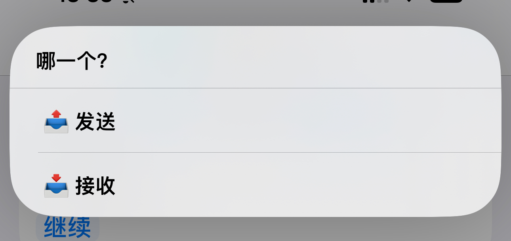

# AirDrop Plus

A file transfer and clipboard synchronization tool between Windows and iOS devices implemented using Python and Shortcuts.

[中文](readme_zh.md)

# Requirements

```
python==3.10.6
flask==3.0.0
psutil==5.9.6
pyinstaller==6.2.0
windows_toasts==1.1.0
pillow==10.1.0
pyperclip~=1.8.2
pystray==0.19.5
```

# How to Pack

```bash
pyinstaller --add-data 'config;config' --add-data 'static;static' -w AirDropPlus.py
```

# Using Steps
1. Install Bonjour on Windows, which allows you to access Windows using the 'DeviceName.local' instead of an IP address.
    <div style="text-align:center;">
        
    </div>
2. Modify the configuration file 'config.ini' to set the file save path and key (the packaged configuration file is located at '_internal/config.ini').
3. Start 'AirDropPlus', and when prompted with the following pop-up, please click to allow.
    <div style="text-align:center;">
      
    </div>
4. Download the shortcut on the mobile device from: https://www.icloud.com/shortcuts/3fecd0f09d594726b5e0ec46c976ccc4
5. Set up the shortcut:
   - Host(主机)：Windows device name.local (or the host IP address, do not add .local)
   - Port(端口)：The same port number set in 'config.ini'
   - Key(密钥)：The same key set in 'config.ini'
   - Simplify(简化)：Enabling this will disable the function to send the iOS clipboard
   <div style="text-align:center;">
       
   </div>
6. Usage conditions: The iOS device and Windows device must be on the same local area network, or the Windows device can connect to the iOS hotspot, or vice versa. Using a hotspot to send files does not consume data.
7. Functionality Testing:
  - Send files: Execute the 'AirDrop Plus' shortcut from the file sharing menu.
    <div style="text-align:center;">
      
    </div>
  - Receive files: Directly execute the 'AirDrop Plus' shortcut, or set it up in Accessibility to trigger with a double-tap on the back of the phone. The 15 Pro series can set it to trigger with the side button.
    - When 'Simplify' is enabled, running it will allow iOS to receive content copied on Windows (files, images, text).
    - When 'Simplify' is disabled, running it will bring up a menu to choose whether to send the iOS clipboard or receive the Windows clipboard.
    <div style="text-align:center;">
      
      
    </div>

# Issues and solutions
### 1. Shortcut Instruction Timeout:
1. Check if the local area network (LAN) environment is unobstructed (in campus network environments, communication with LAN devices may be prohibited).
2. Verify that the port number set in the **config.ini** file matches the one set in the shortcut instruction.
3. Ensure that the hostname set in the shortcut instruction is consistent with **the computer's hostname** (the hostname should not be in Chinese). You can also try changing hostname.local to **IP address**.
4. Check if the computer's firewall is blocking the port set in the **config.ini** file. Remove all entries related to AirDropPlus and restart AirDropPlus. After the restart, please allow the pop-up for network requests.
    <div style="text-align:center;">
      
      
    </div>

### 2. No notification after startup, but the process is running in the background:
1. It's possible that the computer's system version is too old to support interactive notifications. Try changing to basic notifications in the **config.ini** file.
    <div style="text-align:center;">
      
    </div>

# API
## 0. Request Header Parameters
| Arg Name        | Type   | Description                                                                                                                                                     |
|-----------------|--------|-----------------------------------------------------------------------------------------------------------------------------------------------------------------|
| ShortcutVersion | String | The version of the shortcut. It must match the 'version' in the config.ini file.                                                                                |
| Authorization   | String | The key. It must match the first two segments of the 'key' in the config.ini file. For example, if the config.ini file has a version 1.5.1, this should be 1.5. |

## 1. Send File
> Send a file from the mobile device to the PC.
### URL
[POST] /file

Request Body: Form

| Arg Name | Type | Description      |
|----------|------|------------------|
| file     | File | The File to Send |

### Return
- Return Type: JSON
- Return Content:
    ```json
    {
        "success": true,
        "msg": "发送成功",
        "data": null
    }
    ```
## 2. Retrieve File
> Retrieve a file on the PC
### URL
[GET] /file/[path]

| Arg Name | Type   | Description                      |
|----------|--------|----------------------------------|
| path     | String | Base64 encoding of the file path |
### Return
- Return Type: File

## 3. Send Clipboard
> Send the clipboard to PC
### URL
[POST] /clipboard
### Request Parameters
- Request Body: Form

| Arg Name  | Type   | Description              |
|-----------|--------|--------------------------|
| clipboard | String | Mobile Clipboard Content |

### Return
- Return Type: JSON
- Return Content:
    ```json
    {
        "success": true,
        "msg": "发送成功",
        "data": null
    }
    ```
## 4. Retrieve Clipboard Content
> Retrieve the Clipboard Content on PC
### URL
[GET] /clipboard
### Return
- Return Type: JSON
- Return Content: 
  - When the Clipboard Contains Text:
    ```json
    {
        "success": true,
        "msg": "",
        "data": {
          "type": "text",
          "data": "clipboard_text"
        } 
    }
    ```
  - When the Clipboard Contains File:
      ```json
      {
          "success": true,
          "msg": "",
          "data": {
            "type": "file",
            "data": ["file2PathBase64", "file2PathBase64", ...]
          }
      }
      ```
  - When the Clipboard Contains Image:
      ```json
      {
          "success": true,
          "msg": "",
          "data": {
            "type": "img",
            "data": "img_base64_code"
          }
      }
      ```
## 5. Test
> Test Connection
### URL
[GET] /
### Return
- Return Type: Text
- Return Content: Hello world!