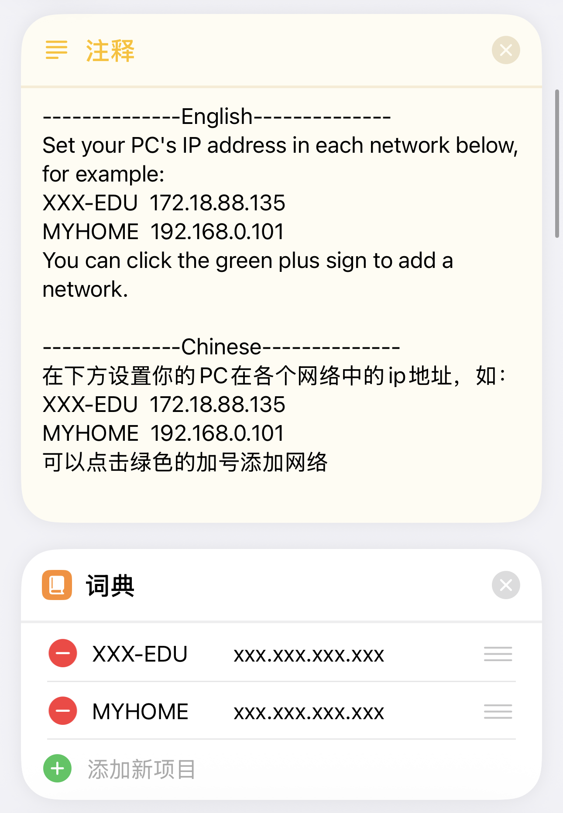

# AirDrop Plus

用于 iOS 设备和 Windows 电脑之间进行文件传输，基于 HTTP，需要配合快捷指令使用

[English](readme.md)

# 请作者喝杯咖啡
<div style="text-align:center;">
    <p>支付宝</p>
    
    <p>微信</p>
    
</div>

# 依赖

```
python==3.10.6
flask==3.0.0
psutil==5.9.6
pyinstaller==6.2.0
windows_toasts==1.3.1
pillow==10.1.0
pyperclip~=1.8.2
pystray==0.19.5
```

# 打包

```bash
python build.py
```

# 使用
0. 网络 
    - 你的 iPhone 和 PC 必须在同一个局域网下, 或者 PC 连接 iPhone 热点，或 iPhone 连接 PC 热点。
    - (使用热点传输文件不消耗流量)
1. 在 PC 上安装 Bonjour (可选)
    - 安装 Bonjour 可以使你的 PC 通过 'hostname.local' 访问，而不需要通过 IP 地址访问。
    - 最新版的 Bonjour 可能会遇到无法通过 'hostname.local' 访问的情况. 建议降低版本。
    <div style="text-align:center;">
        
    </div>
2. 启动 AirDropPlus.exe

    启动 'AirDropPlus.exe'，弹出如下弹框请点击允许。
    <div style="text-align:center;">
      
    </div>
3. 设置 AirdropPlus
    - 右键托盘图标，打开网页设置进行配置
4. 在 iPhone 上获取快捷指令
   https://www.icloud.com/shortcuts/71bfd351276c4d5bb12e538391bc7eb4
   <div style="text-align:center;">
       
   </div>
5. 设置快捷指令:
   - host：'hostname.local'
   - port：和PC端设置中一样的 port
   - key：和PC端设置中一样的 key
   <div style="text-align:center;">
       
   </div>
   如果你的PC不支持 'hostname.local'访问，可以使用 PC 的 IP 地址替代。在下面这个列表中填写你所有场景下的wifi名称和PC的ip组合。
   <div style="text-align:center;">
       
   </div>
6. 设置快捷指令触发方式(三选一):
   1. 在 '设置-辅助功能-触控-轻点背面' 中设置双击手机背面触发快捷指令。
   2. iPhone 15 Pro 系列可以通过侧边按钮触发。
      <div style="text-align:center;">
        
      </div>
   3. 新版 iOS 可以在控制中心设置中添加 'AirDrop Plus' 快捷指令。
      <div style="text-align:center;">
        
      </div>
7. 解除快捷指令发送文件数量限制（不进行该项设置会导致发送多张图片时报错）
   iPhone-设置-App-快捷指令-高级-允许共享大量数据
8. 功能测试:
    - **发送文件**:
      将 AriDrop Plus 快捷指令添加到共享菜单的个人收藏中。
      <div style="text-align:center;">
        
      </div>
      <div style="text-align:center;">
        
      </div>
      在共享菜单中点击 'AirDrop Plus'。
      <div style="text-align:center;">
        
      </div>
      PC端在收到文件后会弹出通知。
      <div style="text-align:center;">
        
      </div>
   - **发送文本**:
     1. 复制你想发送的文本
     2. 触发快捷指令，点击 'Send' 选项。
     <div style="text-align:center;">
       
     </div>
   - **接收文件或文本**: 
     1. 触发快捷指令
     2. 点击 'Receive' 选项，以接收 PC 端剪贴板中的文件或文本。
     <div style="text-align:center;">
       
     </div>

# 问题和解决方法
### 1. 快捷指令超时:
1. 检查局域网是否通畅。校园网的局域网连接可能会被禁止。
2. 检查PC端设置中的 port 是否和快捷指令中设置的相同。
3. 确保快捷指令里设置的 **设备名.local** 正确 (设备名不能是中文，也最好不要加-). 可以尝试把 **设备名.local** 换成 **IP address** 试试。
4. 检查 PC 端防火墙是否有禁用 **config.ini** 中设置的端口号。移除所有有关AirDropPlus的项目，再重启 AirDropPlus，在弹框中允许网络访问。
    <div style="text-align:center;">
      
      
    </div>

### 2. 启动后无通知，但后台进程还在运行:
1. 可能是 Windows 版本太低，不支持交互式通知。尝试在PC端设置中开启基本通知样式。
    <div style="text-align:center;">
      
    </div>

# API
## 0. Request Header Parameters
| Arg Name        | Type   | Description                                                                                                                                                     |
|-----------------|--------|-----------------------------------------------------------------------------------------------------------------------------------------------------------------|
| ShortcutVersion | String | The version of the shortcut. It must match the 'version' in the config.ini file.                                                                                |
| Authorization   | String | The key. It must match the first two segments of the 'key' in the config.ini file. For example, if the config.ini file has a version 1.5.1, this should be 1.5. |

## 1. Send File
> Send a file from the mobile device to the PC.
### URL
[POST] /file

Request Body: Form

| Arg Name | Type | Description      |
|----------|------|------------------|
| file     | File | The File to Send |

### Return
- Return Type: JSON
- Return Content:
    ```json
    {
        "success": true,
        "msg": "发送成功",
        "data": null
    }
    ```
## 2. Retrieve File
> Retrieve a file on the PC
### URL
[GET] /file/[path]

| Arg Name | Type   | Description                      |
|----------|--------|----------------------------------|
| path     | String | Base64 encoding of the file path |
### Return
- Return Type: File

## 3. Send Clipboard
> Send the clipboard to PC
### URL
[POST] /clipboard
### Request Parameters
- Request Body: Form

| Arg Name  | Type   | Description              |
|-----------|--------|--------------------------|
| clipboard | String | Mobile Clipboard Content |

### Return
- Return Type: JSON
- Return Content:
    ```json
    {
        "success": true,
        "msg": "发送成功",
        "data": null
    }
    ```
## 4. Retrieve Clipboard Content
> Retrieve the Clipboard Content on PC
### URL
[GET] /clipboard
### Return
- Return Type: JSON
- Return Content: 
  - When the Clipboard Contains Text:
    ```json
    {
        "success": true,
        "msg": "",
        "data": {
          "type": "text",
          "data": "clipboard_text"
        } 
    }
    ```
  - When the Clipboard Contains File:
      ```json
      {
          "success": true,
          "msg": "",
          "data": {
            "type": "file",
            "data": ["file1_path_base64", "file2_path_base64", "file3_path_base64"]
          }
      }
      ```
  - When the Clipboard Contains Image:
      ```json
      {
          "success": true,
          "msg": "",
          "data": {
            "type": "img",
            "data": "img_base64_code"
          }
      }
      ```
## 5. Test
> Test Connection
### URL
[GET] /
### Return
- Return Type: Text
- Return Content: Hello world!