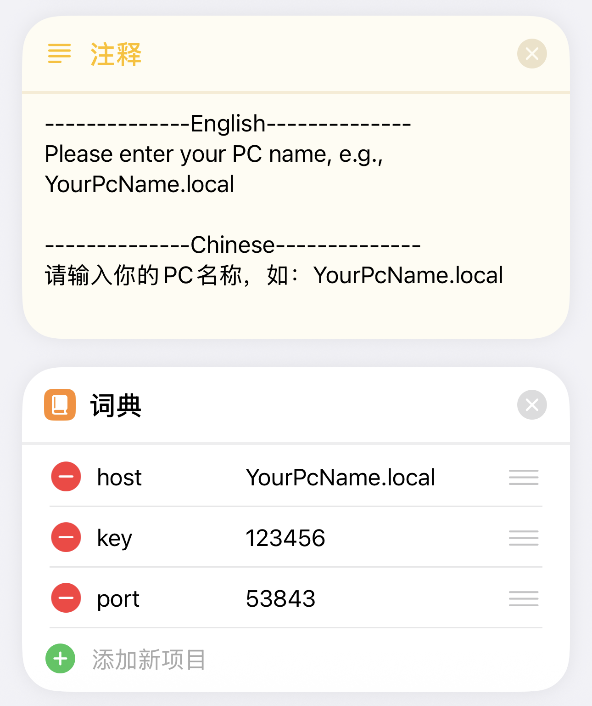

# AirDrop Plus

用于 iOS 设备和 Windows 电脑之间进行文件传输，基于 HTTP，需要配合快捷指令使用

[English](readme.md)

# 依赖

```
python==3.10.6
flask==3.0.0
psutil==5.9.6
pyinstaller==6.2.0
windows_toasts==1.1.0
pillow==10.1.0
pyperclip~=1.8.2
pystray==0.19.5
```

# 打包

```bash
pyinstaller --add-data 'config;config' --add-data 'static;static' -w AirDropPlus.py
```

# 使用
1. Windows安装bonjour，这样就可以通过 '设备名.local' 访问到Windows，而不需要通过IP地址。
    <div style="text-align:center;">
        
    </div>
2. 修改配置文件 'config.ini'，设置文件保存路径和密钥（打包后的配置文件在'_internal/config.ini'）
3. 启动 'AirDropPlus'，出现以下弹框请点击允许
    <div style="text-align:center;">
      
    </div>
4. 手机端下载快捷指令：https://www.icloud.com/shortcuts/3fecd0f09d594726b5e0ec46c976ccc4
5. 设置快捷指令：
   - 主机：Windows设备名.local（也可以是主机ip地址，不要加.local）
   - 端口：和 'config.ini' 中设置的端口相同
   - 密钥：和 'config.ini' 中设置的密钥相同
   - 简化：启用时会关闭发送iOS剪贴板的功能
   <div style="text-align:center;">
       
   </div>
6. 使用条件：iOS设备和Windows设备在同一个局域网下，也可以是Windows连接iOS的热点，或者iOS连接Windows的热点，使用热点发送文件不消耗流量
7. 功能测试
  - 发送文件：在文件分享菜单执行'AirDrop Plus'快捷指令
    <div style="text-align:center;">
      
    </div>
  - 接收文件：直接执行'AirDrop Plus'快捷指令，也可以在辅助功能中设置成双击手机背面触发，15 Pro系列可以设置成侧边按钮触发。
    - 当'简化'被开启时，运行后iOS接收Windows上复制的内容(文件、图像、文本)。
    - 当'简化'被关闭时，运行后会弹出一个菜单，选择发送iOS剪贴板，还是接收Windows剪贴板
    <div style="text-align:center;">
      
      
    </div>

# 问题
### 1. 快捷指令运行超时：
1. 检查局域网环境是否通畅（校园网环境可能局域网设备的通信是被禁止的） 
2. 检查**config.ini**中设置的端口号是否与快捷指令中设置的一致
3. 检查快捷指令设置的**主机名**是否与电脑**主机名**一致（主机名不能是中文）。也可以把**主机名.local**改成IP地址试试
4. 检查电脑防火墙是否屏蔽了**config.ini**中设置的端口，删除与 AirDropPlus 相关的所有项，并重启 AirDropPlus。重启完成后请允许网络请求的弹框
    <div style="text-align:center;">
      
      
    </div>

### 2. 启动后没有通知，但后台查看进程是在运行的：
1. 可能是电脑系统版本比较旧不支持交互式通知，在**config.ini**里改成传统通知试试
    <div style="text-align:center;">
      
    </div>

# API
## 0. 请求头参数
| 参数名             | 类型     | 描述                                                            |
|-----------------|--------|---------------------------------------------------------------|
| ShortcutVersion | String | 快捷指令的版本，需要和 config.ini 中的 version 一致                          |
| Authorization   | String | 密钥，需要和 config.ini 中的 key 前两位一致，例如 config.ini 为 1.5.1，此处需要是1.5 |

## 1. 发送文件
> 移动端发送一个文件到PC
### 请求
[POST] /file

请求体: Form

| 参数名            | 类型     | 描述                                                                                                                                |
|----------------|--------|-----------------------------------------------------------------------------------------------------------------------------------|
| file           | File   | 要发送的文件                                                                                                                            |

### 返回
- 返回类型: JSON
- 返回内容:
    ```json
    {
        "success": true,
        "msg": "发送成功",
        "data": null
    }
    ```
## 2. 获取文件
> 获取PC上的文件
### URL
[GET] /file/[path]

| 参数名      | 类型     | 描述            |
|----------|--------|---------------|
| path     | String | 文件路径的base64编码 |
### 返回
- 返回类型: 文件

## 3. 发送剪贴板
> 发送剪贴板发送到PC
### URL
[POST] /clipboard
### 请求参数
- 请求体: Form

| 参数名       | 类型     | 描述       |
|-----------|--------|----------|
| clipboard | String | 移动端剪贴板内容 |

### 返回
- 返回类型: JSON
- 返回内容:
    ```json
    {
        "success": true,
        "msg": "发送成功",
        "data": null
    }
    ```
## 4. 获取剪贴板
> 获取PC端的剪贴板内容
### URL
[GET] /clipboard
### 返回
- 返回类型: JSON
- 返回内容: 
  - 剪贴板内容为文本时:
    ```json
    {
        "success": true,
        "msg": "",
        "data": {
          "type": "text",
          "data": "clipboard_text"
        } 
    }
    ```
  - 剪贴板为文件时:
      ```json
      {
          "success": true,
          "msg": "",
          "data": {
            "type": "file",
            "data": ["文件1路径的base64", "文件2路径的base64"]
          }
      }
      ```
  - 剪贴板为图像时:
      ```json
      {
          "success": true,
          "msg": "",
          "data": {
            "type": "img",
            "data": "img_base64_code"
          }
      }
      ```
## 5. 测试
> 测试连接
### URL
[GET] /
### 返回
- 返回类型: Text
- 返回内容: Hello world!